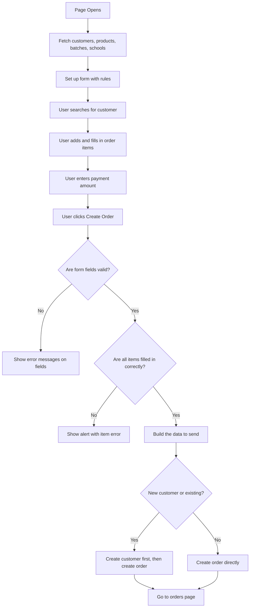

# 🧾 Order Creation Flow — How It Works (Simple English Guide)

This document walks through **everything that happens**, step-by-step, from the moment a user clicks the "Create Order" page to the moment the order is saved in the database. 

It explains what each file does, why it was built that way, and shows real-world examples in simple, everyday English. No complex jargon, just clean explanations!

---

## 📑 Table of Contents

- [1. The Analogy: Waiter and Calculator](#1-the-analogy-the-waiter-and-the-calculator)
- [2. The Files Involved](#2-the-files-involved)
- [3. What the Order Hook Does](#3-what-the-order-hook-does)
- [4. Every Order Function Explained](#4-every-order-function-explained)
- [5. Step-by-Step Walkthrough in Action](#5-step-by-step-walkthrough-in-action)
- [6. What Lives Where](#6-what-lives-where)
- [7. Design Decisions & Why](#7-design-decisions--why)

---

## 1. The Analogy: The Waiter and the Calculator

To understand how the files work together, imagine a busy shop:

* **The Order Hook (`useCreateOrderForm.js`) is the Waiter's Notebook.**
  * The Waiter's Notebook has **memory**. It remembers who the customer is, what items they have added to their table, and how much they have paid so far. If you close the notebook, the order is still written there.
* **The Order Helpers (`orderHelpers.js`) is the Calculator on the counter.**
  * The Calculator has **no memory**. If you leave it alone, it remembers nothing. It only does something when the Waiter inputs numbers and presses "equals." It is a tool used to do quick calculations, double-check rules, and clean up messy notes.

---

## 2. The Files Involved

### 📁 `CreateOrder.jsx` (The Page)
* **What it does:** The main page. It fetches data from the server, sets up the form, and handles the "Create Order" button click.
* **Think of it as:** The manager overseeing the whole transaction.

### 📁 `useCreateOrderForm.js` (The Hook)
* **What it does:** A custom React hook that manages the tricky, changing parts — the customer selection, the list of items being ordered, and the running totals.
* **Think of it as:** The waiter's notebook where they jot down each item as you order.

### 📁 `orderHelpers.js` (The Helpers)
* **What it does:** Small helper functions — clearing fields when you switch type, copying product details into the order, validating that all items are filled in, and formatting data for the server.
* **Think of it as:** The calculator and cheat sheet on the counter.

### 📁 `CustomerInput.jsx` (The Search Box)
* **What it does:** The search box where you type a customer's name, see matches, and either pick an existing customer or create a new one right there.
* **Think of it as:** The clerk looking you up in the customer book.

### 📁 `OrderItemList.jsx` (The Items List)
* **What it does:** Shows the "Order Items" section — the header, an empty state message if there are no items, and the list of items.
* **Think of it as:** The order board on the wall.

### 📁 `OrderItemRow.jsx` (The Row)
* **What it does:** One row in the items list. Shows the dropdowns and inputs for a single item — pick a product, pick a size, enter quantity, etc.
* **Think of it as:** One line item on your receipt.

### 📁 `InventoryHooks.js` & `InventoryAPI.js` (The Network)
* **What they do:** Send requests to the server (e.g., "create this order," "get all products") and handle user login tokens.
* **Think of them as:** The phone line itself to the kitchen (backend).

---

## 3. What the Order Hook Does

The `useCreateOrderForm` hook manages all the **dynamic, changing parts** of the form. The simple fields (customer name, paid amount, notes) are handled by React Hook Form. The hook handles everything else.

### State (Memory) the Hook Manages:
* **`customerMode`** (true / false / null)
  * true = user picked an existing customer
  * false = user wants to create a new customer (shows extra fields)
  * null = nothing selected yet
* **`selectedCustomer`** (the full customer details object, or null)
  * When you pick "Jane Doe" from the search results, this holds all of Jane's info — her ID, name, phone number, etc.
* **`orderItems`** (an array of items)
  * Every time you click "Add Item," a new entry is added to this array. Each entry can be a product from your catalog, a batch from your warehouse, or a custom tailored item.

### What the Hook Receives:
* **`watch`** — A function from React Hook Form that lets us read form values in real time. We use it to see the paid amount as the user types and calculate the balance live.
* **`existingProducts`** — The list of all products fetched from the server. When a user picks a product, we copy its details (type, variant, color, price) into the order item.
* **`existingBatches`** — The list of all warehouse batches from the server. Same reason — copy batch details when a user picks a batch.

---

## 4. Every Order Function Explained

Here is exactly what every function does, using simple English and examples.

### 🎛️ Hook Functions (`useCreateOrderForm.js`)

#### `manageItem(operation, index, field, value)`
* **What it does:** Add, remove, or update items in the order list.
* **How it works:**
  * If `operation` is `"add"`, it adds a new blank row to the list with a unique row ID (UUID) and a starting quantity of 1.
  * If `operation` is `"remove"`, it filters out the row at the specified index.
  * If `operation` is `"update"`, it loops through the list of items. When it finds the row index, it updates the specific field with the new value. It also checks if it needs to automatically copy details (if the product or batch ID changed) or reset fields (if the source type changed).
* **Example:** Clicking "Delete" on Row #2 calls `manageItem("remove", 2)`.

#### `manageMeasurement(operation, itemIndex, mIndex, field, value)`
* **What it does:** Manage custom measurements (like chest or waist sizes) for custom-tailored items.
* **How it works:**
  * If `operation` is `"add"`, it adds a blank measurement row (name and value) to the specified order item index.
  * If `operation` is `"remove"`, it deletes the measurement at `mIndex` inside the item's list.
  * If `operation` is `"update"`, it updates the name (e.g., "Waist") or value (e.g., "34 inches") inside that item's measurements.
* **Example:** Typing "38 inches" in the value box on Item #0 calls `manageMeasurement("update", 0, 0, "measurementValue", "38 inches")`.

---

### 🧮 Helper Functions (`orderHelpers.js`)

#### `resetSourceFields(item)`
* **What it does:** Clears out old selections and IDs when a user switches the source type on an item row.
* **How it works:** Wipes out `productId`, `batchId`, `size`, `type`, `variant`, `color`, and `unitPrice`, and sets `customMade` to true if the new source is `"custom"`.
* **Example:** Switching Row #0 from "Product" to "Custom" wipes out the Red T-Shirt selection so you don't accidentally send old IDs to the server.

#### `copyProductDetails(item, product)`
* **What it does:** Automatically fills in product details (type, variant, color, price) into an item row.
* **How it works:** Copies values directly from the catalog product. Keeps size empty so the user is forced to select a size.
* **Example:** User selects "Classic Red T-Shirt" (priced at $25.00). This helper instantly fills in: Type: Tops, Variant: T-Shirt, Color: Red, Price: $25.00.
* **Why this matters:** If you edit the product price to $30.00 tomorrow, this order stays locked at $25.00. This protects your financial records!

#### `copyBatchDetails(item, batch)`
* **What it does:** Automatically fills in warehouse batch details (type, variant, color, price) into an item row.
* **How it works:** Same as product details, but reads from a direct warehouse batch instead.
* **Example:** User selects batch "White T-Shirt Bulk" (priced at $20.00). It instantly fills in: Type: Tops, Variant: T-Shirt, Color: White, Price: $20.00.

#### `validateOrderItems(items)`
* **What it does:** Double-checks every item row to make sure the user filled in all required fields before saving.
* **How it works:** Loops through each item. If a product has no product selected, or has no size, or a custom item has no price, or measurements are missing names/values, it returns a clear error message. If everything is perfect, it returns null.
* **Example:** If Item #1 has no size selected, it returns: `"Item 1: Please select a size."`

#### `buildItemsPayload(items)`
* **What it does:** Cleans up our frontend item list and formats it exactly how the server expects it.
* **How it works:** Loops through each item, strips out temporary frontend-only fields (like the temporary React row ID and the layout "source" toggle), and ensures numbers are real decimals.
* **Example:** Converts `{ id: "abc-123", source: "product", productId: "p-1", size: "M", quantity: 2 }` to `{ productId: "p-1", size: "M", quantity: 2 }`.

---

### 🏢 Page Functions (`CreateOrder.jsx`)

#### `buildOrderPayload(data, itemsPayload)`
* **What it does:** Bundles the flat form fields (from React Hook Form) and the clean items list (from the Helper) into a single master order package.
* **How it works:** Merges the paid amount, notes, school ID, and items payload together.
* **Example:** Creates a package containing paid amount: 50.00, notes: "Collect by Friday", schoolId: 1, and the list of ordered items.

#### `handleFormSubmit(data)`
* **What it does:** The traffic controller that handles order submission. It decides whether to create a customer first, or go straight to creating the order.
* **How it works:**
  * Runs `validateOrderItems`. If it fails, shows an alert and stops.
  * Packages up the items using `buildItemsPayload` and builds the order payload.
  * **Path A (Existing Customer):** If the user picked an existing customer, calls `createOrder` immediately with that customer ID.
  * **Path B (New Customer):** If the user is creating a new customer, calls `createCustomer` first. When that finishes successfully, grabs the newly created customer ID, attaches it to the order, and then calls `createOrder`.
  * On complete success, redirects the user back to the `/orders` list.
* **Example:** For a new customer, we must wait for `createCustomer` to finish first because the database won't let us save an order without a real, existing customer ID.

---

## 5. Step-by-Step Walkthrough in Action



### Step 1: Page Loads & Fetches Data
When you open the page, React Query fires 4 requests in parallel:
* `useGetAllCustomers()` — Load customers list
* `useGetAllProducts()` — Load products list
* `useGetAllWarehouseBatches()` — Load warehouse batches list
* `useGetAllSchools()` — Load schools list
These are loaded into browser cache for super-fast, instant lookup.

### Step 2: Customer Search
* User types "Jane" into the search box.
* `CustomerInput.jsx` filters the local cached list instantly (no server lag).
* User clicks "Jane Doe" (existing customer ID: `abc-123`). This calls `handleSelect`, saving Jane's ID and name into the form.

### Step 3: Adding an Item Row
* User clicks **"Add Item"** button.
* `OrderItemList.jsx` calls `onManageItem("add")`.
* A blank row (Row #0) appears on screen.

### Step 4: Configuring the Item
* User selects "Product" source and picks "Classic Red T-Shirt".
* This calls `onManageItem("update", 0, "productId", "prod-1")`.
* The hook grabs the "Classic Red T-Shirt" details from cache, and calls `copyProductDetails`.
* Price ($25.00), color (Red), variant (Classic), and type (T-Shirt) are automatically filled in.
* User selects size "Medium" and types quantity "2".

### Step 5: Enters Deposit & Clicks Save
* Total is computed: $25.00 x 2 = $50.00.
* User types "30.00" in the Paid Amount box.
* Outstanding balance updates live: $20.00.
* User clicks **"Create Order"** button.

### Step 6: Submit Validation & Saving
* Form fields are checked (customer is valid, paid amount is a number).
* Items are checked via `validateOrderItems` (Row #0 has a selected product, size, and valid quantity).
* Items list is packaged via `buildItemsPayload` (temporary IDs removed).
* Since Jane is an existing customer, it runs **Path A**: calls `createOrder` directly with Jane's customer ID.
* On success: clears the orders cache (so the list is fresh) and navigates to `/orders`. New order is visible!

---

## 6. What Lives Where

Here is the exact breakdown of which file handles what:

### React Hook Form (simple, flat fields)
* `customerName` — The customer's name (text input)
* `customerId` — Hidden ID when picking an existing customer
* `phoneNumber` — Phone number (only shown for new customers)
* `paidAmount` — How much the customer paid upfront (number)
* `schoolId` — Which school this order is for (dropdown)
* `notes` — Any extra notes (text area)

### Custom Hook (dynamic, complex state)
* `orderItems[]` — The list of items being ordered (grows as user clicks "Add Item")
* `customerMode` — Are we using an existing customer or creating a new one?
* `selectedCustomer` — The full details of the picked customer
* `totalAmount` — Calculated sum of all items (price x quantity)
* `balance` — Total minus what's been paid
* `manageItem()` — Function to add, remove, or change items in the list
* `manageMeasurement()` — Function to add, remove, or change measurements for custom items

---

## 7. Design Decisions & Why

### Why use an interceptor for the login token?
* **Without interceptor (Bad):** You'd have to add the token to every single API call manually:
  ```js
  inventoryAPI.getCustomers(token);
  inventoryAPI.createOrder(data, token);
  ```
* **With interceptor (Good):** The token is added automatically to every request behind the scenes. One place, applied everywhere, impossible to forget.

### Why copy product/batch details into the order?
* **Without copying (Bad):** If the admin changes a product price from $25 to $30 next month, past orders would suddenly change to $30 — ruining your accounting records.
* **With copying (Good):** Each order stores the price at the time of purchase. Future price changes don't affect past orders.

### Why validate items separately from the form?
* Yup/RHF is great for simple fields like "name required." But order items are complex — they come in 3 types, each with different required fields. Writing this in Yup would be a giant, messy headache.
* Instead, we use `validateOrderItems()` — a simple, plain JavaScript function. It's much easier to read, test, and change.

### Why create the customer first, then the order?
* The database has a strict rule: an order must be linked to a valid customer ID. A new customer doesn't have an ID until they are saved to the database. Therefore, we must save the customer first, grab their new ID from the server's response, and then create the order.

### Why split the work between React Hook Form and a custom hook?
* React Hook Form is excellent at managing simple input fields, validation, and error messages. But it struggles with dynamic lists (like an order items list that grows and shrinks).
* Our custom hook handles that dynamic list, customer selection state, and live totals. By splitting the work, both parts do what they are best at.

### Why use stable IDs for order items?
* If we used array positions (0, 1, 2) as row keys and deleted row #1, React would think row #2 became row #1 and re-use its elements. This causes typed inputs to shift to the wrong rows! Giving each row a unique `id` (UUID) prevents this completely.

### Why clear the cache (invalidate queries) on success?
* When we create an order, the server's data changes. To prevent the screen from showing old data, we clear the cache for `"orders"`. The next time the user visits the orders page, it is forced to fetch the freshest, updated list from the server.
